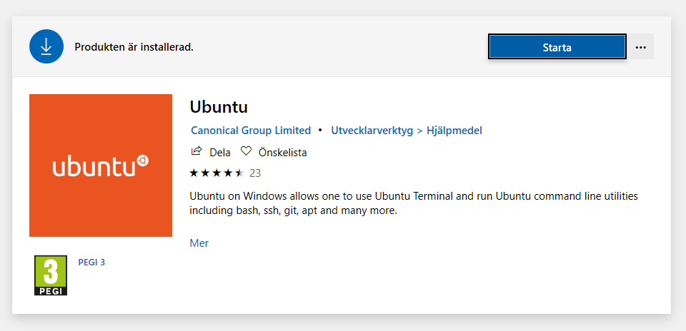

# oh-my-zsh
Setup for ohmyzsh

## Before start on Windows, it's required enable "Windows subsystem for Linux and install Linux system 

* Open PowerShell and type

```Enable-WindowsOptionalFeature -Online -FeatureName Microsoft-Windows-Subsystem-Linux```

* Install Ubuntu from Microsoft Store

<p align="left">
  
</p>

* Afer install it, do the next steps using the Ubunto terminal

## Ohmyzsh installation and customization

* Install it through curl [zsh](https://github.com/ohmyzsh/ohmyzsh)
* Theme installation [spaceship](https://github.com/denysdovhan/spaceship-prompt)
* Open the .zshrc file ```code ~/.zshrc````
* Change the ZSH_THEME to "spaceship"
* In the end of the .zshrc file add he following lines

```SPACESHIP_PROMPT_ORDER=(
  user          # Username section
  dir           # Current directory section
  host          # Hostname section
  git           # Git section (git_branch + git_status)
  hg            # Mercurial section (hg_branch  + hg_status)
  exec_time     # Execution time
  line_sep      # Line break
  vi_mode       # Vi-mode indicator
  jobs          # Background jobs indicator
  exit_code     # Exit code section
  char          # Prompt character
)

SPACESHIP_PROMPT_ADD_NEWLINE=false
SPACESHIP_CHAR_SYMBOL="❯"
SPACESHIP_CHAR_SUFFIX=" "
```

* Install [zplugin](https://github.com/zdharma/zplugin#installation)
* After zplugin installation, the .zshrc file should have this lines added automatically

```### Added by Zplugin's installer
source "$HOME/.zplugin/bin/zplugin.zsh"
autoload -Uz _zplugin
(( ${+_comps} )) && _comps[zplugin]=_zplugin
### End of Zplugin installer's chunk
```

* To install plugins through zplugin, add the pluglin in the end of the file .zshrc following the sintaxy

```zplugin light zsh-users/zsh-autosuggestions
zplugin light zsh-users/zsh-completions
zplugin light zdharma/fast-syntax-highlighting
```
